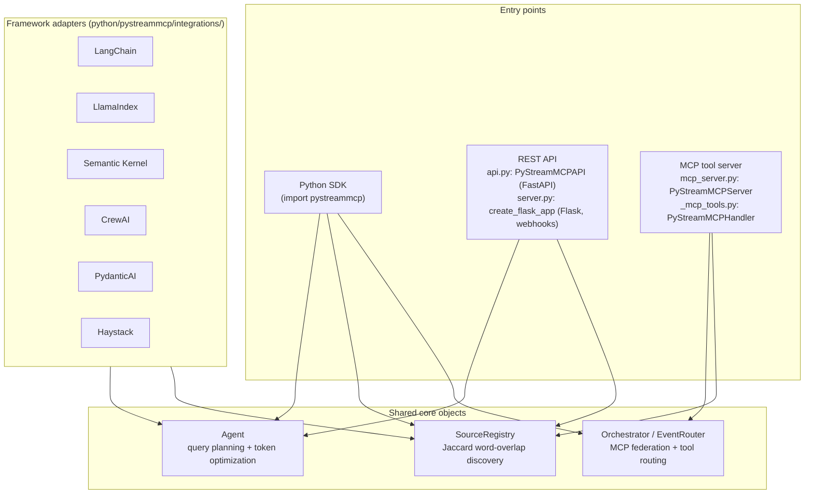

# PyStreamMCP Architecture

This describes what actually ships (the pure-Python package under
`python/pystreammcp/`, built via `setuptools` per `pyproject.toml`). The
`core/`/`python/src` Rust workspace at the repo root is a separate,
currently-non-compiling, unshipped experiment — see the README's
"Rust workspace (not shipped)" section and
[`docs/archive/ARCHITECTURE_RUST_CORE_ASPIRATIONAL.md`](archive/ARCHITECTURE_RUST_CORE_ASPIRATIONAL.md)
for why the old root-level `ARCHITECTURE.md` was archived instead of kept.

## What this package actually does

Three real, independently-usable pieces, all backed by the same core
Python objects (`Agent`, `SourceRegistry`, `Orchestrator`):

1. **`Agent.query()`** — estimates token cost for a query (character-count
   heuristic) and reports a reduction percentage that varies by
   `optimization_strategy` (`token_efficient` / `balanced` /
   `quality_first`).
2. **`SourceRegistry`** — Jaccard word-overlap ranking of manually
   registered data sources against a query string. Not semantic/embedding
   search.
3. **`Orchestrator`** — probes configured MCP endpoints' real `tools/list`
   method, does lexical tool-relevance ranking, and capability matching.
   Federated query *execution* and cross-database joins are accepted at
   the API level but return `{"status": "not_implemented"}` — there is no
   query engine behind them.

## Three surfaces, one implementation

All three surfaces call into the same `Agent`/`SourceRegistry`/
`Orchestrator` instances rather than each re-implementing query planning —
verified by reading `_mcp_tools.py`'s handler methods and `api.py`'s route
bodies, and covered by `tests/test_mcp_tools_handler.py`,
`tests/test_discovery.py`, `tests/test_okf_discovery.py`.

## Webhook / event flow

`server.py`'s Flask app exposes `POST /orchestration/webhooks/events` for
other MCP-enabled services to report `mcp.available`, `tool.invoked`, etc.
Every inbound event must carry `X-PyStreamMCP-Signature:
sha256=<HMAC-SHA256 hex digest>`; the endpoint fails closed (503) if
`PYSTREAMMCP_WEBHOOK_SECRET` is unset, and rejects (401) on a missing or
wrong signature — verified by `tests/test_webhook_hmac_auth.py` (round
trip, tampered body, missing header, missing secret, all asserted).
Accepted events are dispatched into `webhook_router.py`'s `EventRouter` /
`ServiceRegistry` / `ToolChainOrchestrator` / `FallbackManager`, which is
what `Orchestrator.discover_mcp_projects()` and friends read from.

## OKF (Open Knowledge Format) integration

`okf_core.py` / `okf_discovery.py` / `okf_query_planner.py` implement a
separate, real, tested feature: MCP system/tool metadata stored as
git-trackable markdown documents, with a query planner that finds the
cheapest tool-call path across a catalog. See
[`../OKF_INTEGRATION.md`](../OKF_INTEGRATION.md) for the API. Covered by
`tests/test_okf_core.py`, `tests/test_okf_discovery.py`,
`tests/test_okf_query_planner.py`.

## Orchestration-tool adapters — a known gap

`python/pystreammcp/orchestration/{temporal,airflow,nocode_rpa}.py` wrap
`Agent.query()` correctly for the *query* activity/operator in each of
Temporal, Airflow, n8n/Power Automate/RPA. Their **discovery**
activity/operator (`TemporalDiscoveryActivity.execute()` in `temporal.py`,
the discovery `execute()` in `airflow.py`, and the equivalent in
`nocode_rpa.py`) does **not** call `SourceRegistry` — each independently
returns a hardcoded list of `source_0..source_4` with a fabricated
`relevance = 0.95 - i*0.05` regardless of the registry's actual contents,
behind a `# In production, use actual discovery logic` comment. This is
tracked in [`../ROADMAP_HONEST.md`](../ROADMAP_HONEST.md) rather than
fixed in this pass.

## Testing

`tests/conftest.py` centralizes `sys.path` setup and exposes
`mock_adapter` / `failing_agent` / `failing_adapter` / `llm_failure`
fixtures backed by `pystreammcp/testing.py` (`MockAdapter`,
`RateLimitError`, `ContextWindowExceededError`,
`MalformedModelResponseError`, `FailingAgent`, `FailingAdapter`) so
downstream projects can inject the same failure modes into their own test
suites. `mcp_server.py`'s `call_tool` / `process_message` catch exceptions
raised during tool execution and return a structured
`{"status": "error", ...}` response rather than propagating uncaught —
see `tests/test_mcp_server_resilience.py`.

375 Python tests pass as of this pass (`pytest tests/ -v`, Python 3.11).
See [`../ROADMAP_HONEST.md`](../ROADMAP_HONEST.md) for what is *not*
tested or known to be broken.
